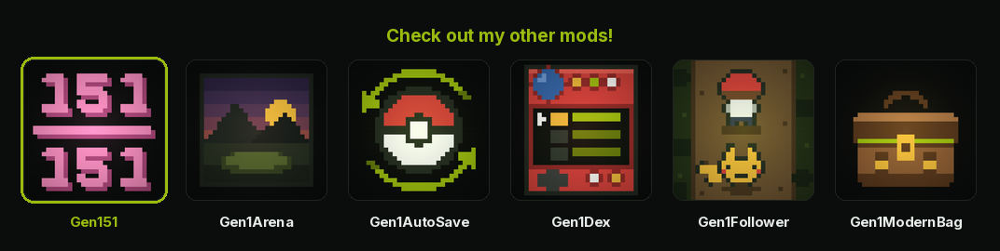

<p align="center">
  <a href="https://wild1walker.github.io/Gen1Wild/"></a>
</p>

<h1 align="center">Gen151</h1>

<p align="center">
  <a href="https://wild1walker.github.io/Gen1Wild/"></a>
</p>

<p align="center">
  <b>All 151, renewably, in one save</b>
</p>

Every one of the 151 becomes obtainable **renewably** in a single save, on any
one version, without trading — while every encounter that exists in the vanilla
game keeps its exact vanilla behaviour.

For [Pokemon Gen1Recomp](https://github.com/bryanthaboi/gen1recomp), mod API 2,
Red / Blue / Yellow.

```sh
# drop it in and play
cp -r Gen151 <gen1recomp>/mods/gen151

# or check it first
python3 tools/modkit.py validate mods/gen151 --base imported
python3 tools/modkit.py lint mods/gen151
```

---

## The two words

**Renewable.** Not "obtainable". A one-time static, a gift NPC or a scripted
event does not count, even when it fills the dex slot. If you KO it, flee, run
out of Balls, or want a second one to evolve, the game has to be able to
produce another. Every species Gen151 touches ends up in a table that can be
rolled again tomorrow.

**Additive.** Gen151 never rewrites a vanilla encounter slot, never changes a
vanilla encounter rate, and never removes a species from a table it already
occupies. The only new thing that can happen is a new thing.

What that costs, stated plainly: vanilla species' **share** of a placed map's
encounters shifts by the substitution rate. Probability is conserved and
something has to give. It is listed per row in [SPOILERS.md](SPOILERS.md), and
it is a single number you can turn down — or off — in the options. Two ceilings
bound it: no placement is ever more than **4.30%** of a map (vanilla's own ninth
slot) and no map gives away more than **25%** of its encounters, so three
encounters in four are vanilla everywhere.

### How rare is rare

Gen 1 picks a wild slot from ten buckets out of 256, whose widths are
`51 51 39 25 25 25 13 13 11 3`. So the rarest thing the cartridge ever asks you
to find is a tenth-slot species at **3/256 = 1.17%** — about 85 encounters.
Nothing here is rarer than that, because a mod whose premise is that the vanilla
encounter is untouched has no business charging more for its own additions than
the game charges for its own.

| tier | anchored to | the hunt |
|---|---|---|
| uncommon | vanilla's 9th slot, 11/256 | ~160 steps |
| rare | between the 9th and the 10th | ~280 steps |
| very rare | vanilla's 10th slot, 3/256 | ~600 steps |

**A tier is a promise about the hunt, not about the share.** A fixed share costs
nearly twice as much on an 8/256 route as on a 15/256 one — same word on the
tin, twice the walk — so the share is re-solved from each map's own encounter
rate and the *walk* is what stays constant. Where a ceiling bites, the hunt runs
longer than the target rather than let this mod rewrite what lives on a quiet
map. On a busy map the share dips the other way, below 1.17%, for the same
reason in reverse: the map is handing you more encounters, so a smaller slice of
them is the same walk.

Each tier has its **own** ceiling — 4.30% / 3.28% / 2.24%, the geometric mean of
the absolute cap and the tier's own share. One shared ceiling flattened the
ladder: on a 10/256 map the solve wanted 10.4% for an uncommon and 6.2% for a
rare, a single 4.30% cap clamped both to the same number, and an uncommon and a
rare came out with identical odds and identical hunts. Now the ordering holds at
every one of the 256 possible map rates, which the suite checks exhaustively.

### What that costs in real time

At a 25/256 route, medians; a step is 16 frames and a fled battle about 11
seconds, so battles are roughly three-quarters of it:

| tier | odds per encounter | encounters | steps | **median** | unlucky (1 in 10) |
|---|---|---|---|---|---|
| uncommon | 1 in 23 | 16 | 165 | **4 min** | 12 min |
| rare | 1 in 40 | 27 | 284 | **6 min** | 21 min |
| very rare | 1 in 85 | 59 | 606 | **13 min** | 45 min |

Seeing all 23 additions on Red, one after another: **2.6 hours** median, 8.6
hours if every one of them runs long. The worst single hunt is Snorlax at 11
minutes.

This is a retune. The first cut set very rare at 0.4%, three and a half times
rarer than anything in Kanto: ~250 encounters a species, and 5,534 median steps
for a Bulbasaur in Viridian Forest — for a **starter**, the thing a new player
most wants. Seeing all 23 additions once on Red cost about 43,000 steps and
**9.6 hours**.

---

## What it actually does

Nothing here was hand-listed. `tools/gapset.py` reads the
[pret](https://github.com/pret/pokered) disassembly with the same parse the
engine's own extractor performs and computes, for Red, Blue and Yellow
separately, which of the 151 have no renewable source. That gap set is what the
placements answer.

| | Red | Blue | Yellow |
|---|---|---|---|
| renewable in vanilla | 86 / 151 | 86 / 151 | 85 / 151 |
| placed by Gen151 | 23 | 23 | 23 |
| follows by evolution | 16 | 16 | 18 |
| LINK CABLE | 4 | 4 | 4 |
| left alone on purpose | 4 | 4 | 4 |

The four left alone are Articuno, Zapdos, Moltres and Mewtwo — see
[Legendaries](#legendaries) below.

**Version exclusives** get the answer the sibling cartridge already gave. Blue
puts Sandshrew on Routes 4, 8, 9, 10, 11 and 23; Gen151 gives Red the same maps
at the substitution rate, carrying Blue's own levels. Yellow puts Farfetch'd on
Routes 12 and 13 and Lickitung in Cerulean Cave; Red and Blue get those. It is
the most defensible source there is, and it makes the addition feel like it was
always there, because on the other cartridge it was.

**Everything else** is a design decision with a written justification, one per
row, in `placements.lua`. Where a later official Kanto game answered "where does
this live" — Let's Go's wild Bulbasaur in Viridian Forest, its Charmander on
Route 3, its Squirtle on Route 25 — that answer is used verbatim. Where no
official game ever placed the species in Kanto at all, the location is invented
and the reasoning is written down next to it.

**Levels** come from the destination map, never from the species' vanilla gift
level. A Charmander that spawns on Victory Road at level 5 is a dex checkbox; at
the area's band it is a Pokemon you might actually use. Because the three
cartridges disagree about their own bands by as much as twenty levels, the band
is read at load time rather than written down.

---

## Trade evolutions: the LINK CABLE

Alakazam, Machamp, Golem and Gengar are not spawns. Their pre-evolutions are
already in the vanilla grass on every version; what was missing was the trade.

**Celadon Department Store 4F** sells a LINK CABLE for **2100**, on the same
shelf and at the same price as the four evolution stones. It buys exactly one
evolution, the same as a stone does.

Using it runs the evolution as a *trade* evolution, which means B is read and
thrown away exactly as `evolution.asm` does — it always completes, so it always
breaks:

```
. . .
What? KADABRA is
evolving!
        [ the evolution movie ]
KADABRA evolved
into ALAKAZAM!
. . .
ZzZzap!
The LINK CABLE
broke!
```

The break comes **after** the evolution resolves, and only on success. The cable
works, then it fails; reversed, it would read as the evolution failing, and a
consumed item with nothing to show for it is the one outcome that would make
this feel like a tax rather than like flavour.

Why an item and not a level threshold: a level-up rule evolves every Kadabra you
own whether you wanted it or not, and B-cancelling out of it every level is a
bad opt-out.

---

## Finding things

**The dex AREA screen already works.** `TownMap` scans the live encounter tables
and blinks a nest icon on every matching map, so every species Gen151 adds to a
slot table shows up there automatically — no UI code, no contact with the dex at
all. That is why slot placement is preferred over the Super Rod everywhere the
choice exists.

**The screen those hints go on is Gen1Dex's.** Opening AREA on an entry you
have never met, the box under the map, the press that takes it down and the
START that brings it back all live in
[Gen1Dex](https://github.com/wild1walker/Gen1Dex) 1.3.0 and later — the mod
that registers the POKéDEX and draws the row the press lands on. All of it
shipped here first, and reaching a list this mod does not own meant wrapping
two engine screens from the outside and stamping every row with its species so
a dex mod replacing them wholesale did not strand the lookup — which is
exactly the bug that shipped, because Gen1Dex replaces them wholesale. A
content mod has no business owning a UI surface it has to reach two screens
deep to install. What Gen151 keeps is the half that was always its: the
**sentence**.

**What that screen says on its own**, for all 151: the map where a species has
the biggest share of the encounters, that map's own level band, and a rarity
worked out from Gen 1's ten slot buckets — read straight out of the live
encounter tables, so it is right by construction and costs no placement data
at all. A Pokémon that is in no encounter table anywhere falls back to the
evolution table: `EVOLVE ODDISH / AT LV21`, `LINK CABLE / ON KADABRA`, `MOON
STONE / ON NIDORINO`. None of it depends on having caught the thing.

**What Gen151 says instead, for its own spawns.** The encounter tables cannot
carry which tier this mod rolled a placement at, or that a map needs SURF to
reach at all — those are facts about the placement, and the placement is here.
So the mod registers one caption provider with that screen
(`mod.find("Gen1Dex").exports.area.provide`) and answers for the species it
placed, from the same resolved rows the roll layer is using, so a hint cannot
drift from its spawn:

```
+--------------------+
|                    |
|      (Kanto, with  |
|    nests blinking) |
|                    |
|                    |
.--------------------.
| GRASS  Lv31-33     |
| NEEDS STRENGTH   . |
'--------------------'
```

It also covers the two Super Rod placements, which have no slot for AREA to
find and so blink no nest at all.

**Mew is the exception, on purpose.** While its gate is shut it is not in the
encounter table, so there is no nest — and Gen151 answers for it with a
refusal rather than a silence, so the generic reading cannot fill the gap
either. What the player gets is Gen1Dex's own no-record line, which is exactly
what Articuno, Zapdos, Moltres and Mewtwo get: statics live in no wild table,
so nobody has a hint for them. Mew's sealed screen and a legendary's are the
same screen to the glyph — a seal that read differently would say *there is
something here*, which is the one thing it exists not to say. The moment the
gate opens, Mew is captioned like anything else.

**Without Gen1Dex there is no screen to write on.** AREA is the cartridge's
own — no hint, no AREA on an entry you have never met — the mod says so once
in the log, and nothing else about Gen151 changes. Turn **AREA HINTS** off and
Gen1Dex's screen goes back to saying whatever it reads out of the encounter
tables by itself.

Gen151 still declares `engine_internals`, so it still wears the **PATCHES
ENGINE CODE** badge in the manager — but there is one call behind it now: the
LINK CABLE's own sound effect reaches `src.core.Sound`, which the mod surface
has no facade for. The two screen wraps that used to be the reason for it are
Gen1Dex's, and it is Gen1Dex that wears the badge for them.

This is the third attempt at the hint surface. The first was a FIELD NOTES key
item with a screen of its own; the second added a HINT row to the dex side
menu from a companion mod. Both are gone. A player looking for a Pokémon opens
the POKéDEX and presses AREA — that is the surface, and it belongs to the mod
that draws it.

---

## Options

Every independent decision is its own row. The single biggest complaint about
the existing all-151 mod is that it is all-or-nothing; someone who wants the
version exclusives but not a wild Mew should not have to fork it.

| Option | Default | What it does |
|---|---|---|
| GEN151 | on | master switch; off registers nothing at all |
| EXCLUSIVES | on | the version-exclusive spawns |
| GIFT MONS | on | starters, Eevee, Lapras, Porygon, the Dojo pair, the NPC-trade mons |
| FOSSILS | on | Omanyte, Kabuto, Aerodactyl |
| SNORLAX | on | the renewable Snorlax |
| TRADE EVOS | LINK CABLE | LINK CABLE, or off entirely |
| CABLE SOUND | on | the snap; charming once, possibly grating on the fourth use |
| MEW EVENT | on | the Mansion journals and what they unlock |
| TEST BENCH | off | the built-in bench, below — not part of normal play |
| LEGENDARIES | stay til caught | one shot each, but a fled or fainted one comes back |
| RARITY % | 100 | scales every tier at once; 0 disables every substitution; above 100 it also lifts the per-placement ceiling |
| AREA HINTS | on | this mod's own words under Gen1Dex's AREA map (needs Gen1Dex) |

There is no legendary option, because there is nothing to toggle — see below.

---

## Decisions worth knowing about

### Legendaries

Articuno, Zapdos, Moltres and Mewtwo keep their vanilla statics: same object,
same level, same one-at-a-time. No wild slot, no second copy — you get exactly
one of each, so they remain the sole exception to the renewability rule.

What they no longer are is **losable**. On the cartridge the beat flag is set
on *any* non-blackout end — win, catch or flee alike (`Commands.static_battle`,
quoting `home/trainers.asm`) — so knocking one out by accident or panicking and
running deletes that species from the file. That isn't a rare encounter, it's a
saving throw, and the countermeasure players actually use is to save in front of
it and reset on a bad outcome: a workaround for a mechanic rather than a
mechanic.

So: beat one or flee it and **it's standing there again when you come back**.
Catch it and it's gone for good, exactly as in vanilla. Set **LEGENDARIES** to
ONE SHOT for the cartridge's behaviour, saving throw and all.

It also repairs a save that already lost one before this mod was installed.

### Snorlax

Not a legendary, and it does not inherit the exception. Both statics stay, and a
third, very rare Snorlax turns up on Routes 13 and 17 — next door to each
sleeper — so a player who KOs or flees both is not locked out.

### Mew

On by default. Mew is not a static and not an ordinary wild slot: reading all
four Pokemon Mansion journals flips an event flag, and only then does Mew become
a very rare renewable encounter in the basement the journals describe.

This is the one part of Gen151 that is an invention rather than a restoration,
which is why it has a switch of its own — turn it off and Mew stays exactly as
unobtainable as the cartridge left it.

Before the flag is set, Mew is **not in the encounter table at all** — otherwise
the AREA screen would spoil the location the moment anyone opened the dex. The
unlock is an event flag, not a save-schema addition, so it survives
uninstall/reinstall and the debug console can read it:

```
flag GEN151_MEW_FOUND
flag GEN151_MEW_FOUND on
```

### Water

Red and Blue give a live surf rate to Routes 19, 20 and 21 and to nothing else;
every other water table on those cartridges is rate 0. Raising a rate is the one
thing this mod will not do, so almost everything lands in grass — which is also
what the caves, towers and the Mansion roll — or on the Super Rod.

---

## How the roll works, and why it is built this way

The tempting approach is to append an eleventh slot and ship an eleven-entry
`buckets` list. Do not.

`buckets` is a list, and under `record` merge semantics a list in a patch
replaces the target list wholesale. If any other installed mod also appends a
slot and ships its own bucket list, one of you wins and the other's vanishes —
and a slots/buckets length mismatch **does not error**. The roll falls off the
end of the loop, `slots[i]` comes back nil, and the encounter silently becomes
"no encounter". Invisible dead rolls that nobody can debug.

So Gen151 splits the concerns:

- **Data layer** — append slots with the documented `{ __append = { row } }`
  wrapper, so two mods appending to the same map both land. Never a bare `slots`
  list. Never a `buckets` key, at all.
- **Roll layer** — wrap `encounter.roll` and own the roll. Stage one runs the
  engine's *own* `Encounter.roll` against the map's original slots using the
  engine's own bucket list, so the encounter rate and the vanilla distribution
  are untouched and the appended slots are unreachable by construction. Stage
  two, only on an encounter stage one already produced, rolls one independent
  check at the placement's rarity and substitutes.

Two properties fall out, and both are tested:

- With every rarity at 0, the RNG stream is identical to a clean install **draw
  for draw** — the layer consumes no random numbers at all on a map with nothing
  to substitute.
- Another mod's `buckets` cannot reach this roll, because it is never read.

The trade-off that buys: on a map Gen151 touches, another encounter mod's
eleventh-and-beyond slots stay unreachable. They already were, unless that mod
shipped its own bucket list — which is the failure mode above.

---

## Testing it by hand

The headless suites cover everything that can be checked without a screen. For
the rest — whether `ZzZzap` renders, whether the cable snap sounds right,
whether AREA blinks the nest, whether a very-rare tier is a hunt or a chore —
there is a test bench built in. Nothing to install:

1. **MODS → Gen151 → TEST BENCH: ON**
2. **START → BENCH** (or OPTIONS → GEN151 BENCH, directly under the MODS row)

It forces the spawns, hands over the kit, plays the sounds on demand and flips
the Mew gate, so a pass that would take an evening takes a few minutes.

The option defaults **off**, and off means nothing registers — no START row, no
screen, no wrap on the encounter chain. It shipped as a separate mod for the
first two releases; that was the wrong shape, because a bench you have to
download and import separately is a bench that is not there when you want it.

## Testing

```sh
# the roll layer, against the engine's own src/world/Encounter.lua
GEN1RECOMP=/path/to/gen1recomp lua tests/roll_test.lua

# placements.lua's invariants: justifications, gates, bands, no orphans
lua tests/placements_test.lua

# end to end, through the engine's real headless loader, on all three
# versions -- including that neither engine screen is touched, and, with a
# Gen1Dex checkout, that this mod's captions reach the screen Gen1Dex draws
cd /path/to/gen1recomp
GEN151=/path/to/Gen151 GEN1DEX=/path/to/Gen1Dex \
  luajit "$GEN151/tests/mod_load_test.lua"

# regenerate everything derived, then diff
./tools/regen.sh /path/to/gen1recomp /path/to/pokered /path/to/pokeyellow
git diff --exit-code placements.lua hints.lua SPOILERS.md tests/fixtures thumbnail.png

# every box the mod prints, paginated by the real TextBox: a page that
# renders three lines scrolls the first one away before it can be read
cd /path/to/gen1recomp
GEN151=/path/to/Gen151 luajit "$GEN151/tests/text_test.lua"

# the runtime features: the LINK CABLE's use flow, the Mansion journals, the
# legendaries that come back, and the AREA captions -- all driven through the
# buses the mod registered on.  Point GEN1DEX at a Gen1Dex checkout and the
# caption cases run too; without it they are skipped, loudly, because that
# screen is Gen1Dex's
cd /path/to/gen1recomp
GEN151=/path/to/Gen151 GEN1DEX=/path/to/Gen1Dex \
  luajit "$GEN151/tests/features_test.lua"

# the manifest and the shipped tree, through the engine's own modkit
python3 /path/to/gen1recomp/tools/modkit.py validate .
python3 /path/to/gen1recomp/tools/modkit.py lint .

# or all of it at once, which is what CI should run
./tools/check.sh /path/to/gen1recomp /path/to/pokered /path/to/pokeyellow \
  /path/to/Gen1Dex

# build the release archives
./tools/package.sh /path/to/gen1recomp
```

The end-to-end suite asserts every prime directive against the real Kanto
tables: no vanilla species, level or rate changed on any map on any version;
everything added lands in a table that can be rolled again; every gap closes;
and Mew is absent from `data.encounters` until its gate flips. The features
suite drives the LINK CABLE onto a Kadabra and onto a Pidgey, reads all four
journals one at a time, walks a beaten legendary's map again to find its object
back and its beat flag cleared — while a caught one stays caught, `ONE SHOT`
leaves the cartridge's behaviour alone, and a hidden boulder on the same map is
left where it was — and, with Gen1Dex present, reads this mod's captions back
off its AREA screen, Mew's sealed one included; through the loader's own hook
and event tables, so what runs is the wiring as installed.

---

## Layout

```
manifest.json
main.lua           wiring
placements.lua     the single source of truth -- every spawn and every hint
build.lua          placements + the pristine tables -> roll rows and appends
roll.lua           the two-stage roll
rarity.lua         the tier table
hints.lua          GENERATED hint vocabulary
linkcable.lua      the trade-evolution item
dexhints.lua       the words under Gen1Dex's AREA map, for this mod's spawns
mewgate.lua        the journals, and the spawn they unlock
legendaries.lua    the four statics: beaten or fled, back where they were
bench.lua          the in-game bench, registered only when TEST BENCH is on
tools/             the derivation pipeline (not shipped)
tests/             (not shipped)
```

`placements.lua` driving the encounter patches, the hints and SPOILERS.md is the
central structural decision. Everything else is downstream of it.

---

## Credits

By **Wild**.

Derived from the [pret](https://github.com/pret) disassemblies of Pokemon Red,
Blue and Yellow, and built on the encounter, merge and hook seams of
[Pokemon Gen1Recomp](https://github.com/bryanthaboi/gen1recomp).

Tested against a vanilla install and against
[Gen1Dex](https://github.com/wild1walker/Gen1Dex), which owns the AREA screen
this mod writes its captions onto.

Where a later official Kanto game had already answered "where does this live",
that answer is used rather than invented -- Let's Go's Bulbasaur in Viridian
Forest, its Charmander on Route 3, its Squirtle on Route 25. Those placements
are Game Freak's design decisions, not this mod's.

**Pokemon** Red, Blue, Yellow and Let's Go are Nintendo / Creatures /
GAME FREAK. This is an unofficial fan mod, distributed free, with no
affiliation with or endorsement by any of them, and it ships no ROM-derived
content.
